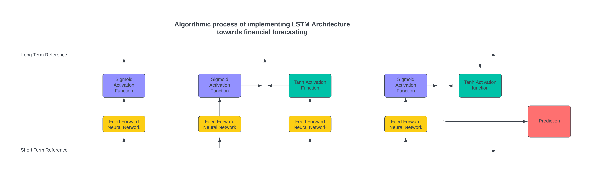
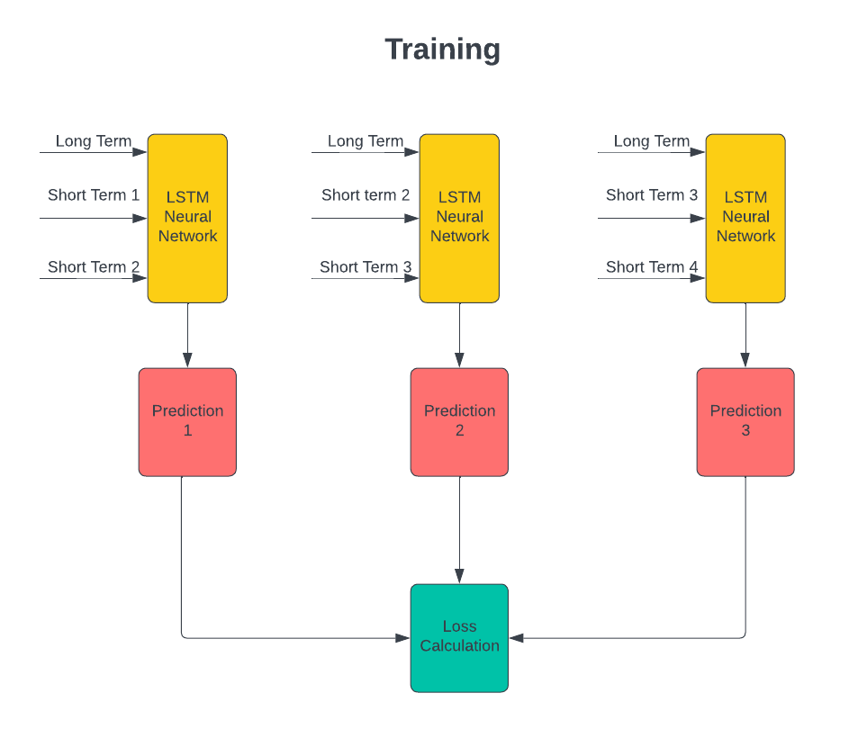
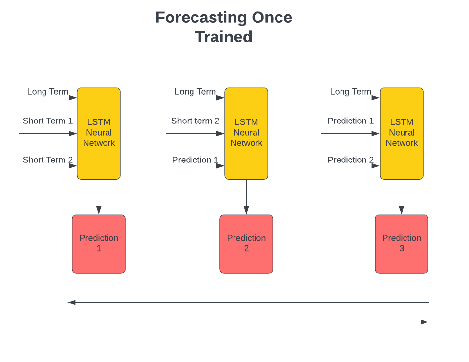

# LSTM-Stock-Prediction

## About:
This repository aims to implement LSTM neural networks streamlined for predicting future stock, and business growth. This repository not only represents a significant tool for businesses, but also an intelligent investing partner for individual investors. While utilizing short and long term interactions this project can be successfully implemented. To conclude, this project streamlines and simplifies trading for everyone, it provides a tool for everyone to become a professional trader without any background skills required.

## Problem Statement:
While this project is also aimed for professionals, the main goal is to make trading successful for everyone. It is to provide an accessible tool for anyone to become a trader and get magnified revenue. It is to give everyone the required tools to succeed in the stock market, while leveraging world class AI tools. It truly does represent a significant leap into financial interactions.

## Used Concepts:
While explaining the complex and intricate architecture of this AI macine would take a whole research paper, here is a streamlined explanation. First of all, this financial model uses a tool called LSTM, this is a type of neural network. In essence a neural network learns from the mistakes while utilizing backpropagation, calculus, and partial derivatives within the learning process. This way it can update the parameters to achieve more accurate results. Although this is valid, this would represent a simple feed forward neural network, an LSTM is a type of recurrent neural network. Subsequently, it reucurs through the data. Although, an LSTM differs from a recurrent neural network by avoiding vanishing/exploding gradients and by also maintaining a long term interaction to the data. This way it can produce more accurate predictions. Find some diagrams below: 

## Accessing Information:
This AI machine will be accessible for both developers, traders, and businesses. Individual traders will obtain access to our AI machine through our simple streamlined web application, while businesses or large enterprises will get access to our models through personalized plans coordinated directly by our team. Finally, developers will get access to our technology through our API interaction. This way, we can develop a diverse technology accessible and personalized to everyones professional necessities.

## Lead Collaborators:
- [GRomeroNaranjo](http://github.com/GRomeroNaranjo) - AI Scientist, AI Developer, and API Backend Dev
- [UrName51](http://github.com/UrName51) - no role yet
- [WulfTheWanderer](http://github.com/WulfTheWanderer) - no role yet

